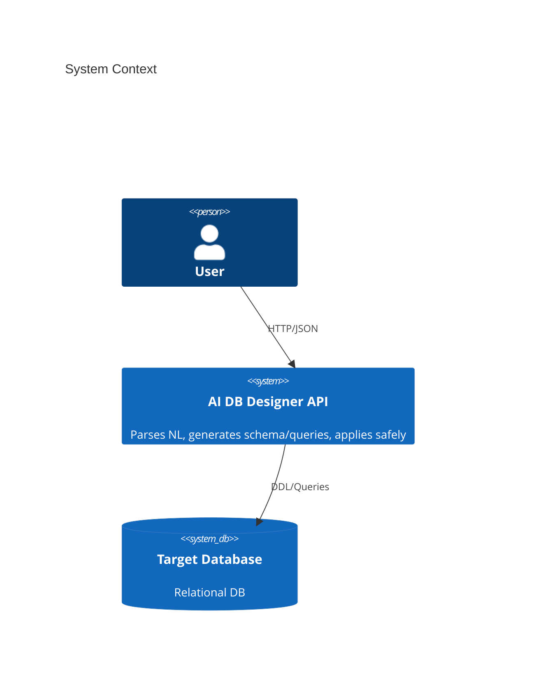
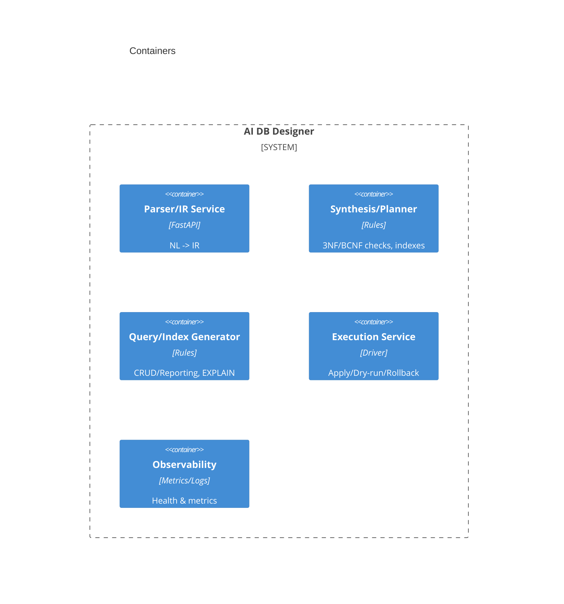

# AI DB Designer — Stubbed Implementation (3‑Hour Sprint)

This repository provides a **stubbed, Dockerized API** that matches the **assessment contracts** for an *AI‑Powered Database Schema Optimizer & Query Generator*. It demonstrates endpoints, response schemas, and operational requirements without a full ML backend.

## What You Get
- FastAPI app with endpoints:
  - `POST /spec/parse`
  - `POST /schema/generate`
  - `POST /schema/apply`
  - `POST /query/generate`
  - `GET /health`
  - `GET /metrics`
  - `GET /demo/unified` (Unified JSON contract demo)
- Deterministic **mock IR**, **DDL bundle**, **queries**, **indexes**, and **rationales**.
- Dockerfile (multi‑stage, non‑root, healthcheck) + `docker-compose.yml`
- Makefile with `build/run/test` targets.

## Quickstart
```bash
# 1) Build
make build

# 2) Run (foreground)
make run
# API available at http://localhost:8000
# Docs: http://localhost:8000/docs

# 3) In another terminal, test
make test
```

Or without Make:
```bash
docker build -t ai-db-designer-stub:latest .
docker run --rm -p 8000:8000 ai-db-designer-stub:latest
```

## Example Requests

### Parse
```bash
curl -X POST http://localhost:8000/spec/parse \
  -H "Content-Type: application/json" \
  -d '{"text":"Patients, Providers, Visits. Each visit links a patient and provider."}'
```

### Generate Schema
```bash
curl -X POST http://localhost:8000/schema/generate \
  -H "Content-Type: application/json" \
  -d '{"text":"Generate normalized schema for patients, providers, visits."}'
```

### Generate Queries & Indexes
```bash
curl -X POST http://localhost:8000/query/generate \
  -H "Content-Type: application/json" \
  -d '{"plan_id":"plan-demo","intents":["list_patients","visits_by_org"]}'
```

### Unified Contract Demo
```bash
curl -s http://localhost:8000/demo/unified | jq .
```

## C4 (Mermaid) — Architecture Sketch




## Notes
- Responses **mirror the assessment’s Unified JSON schema** and endpoint contracts.
- **Security**: This stub is for demo only; add AuthN/Z, secrets, and audit when integrating.
- **Next steps**: Plug in real parsing/normalization and planners behind the existing contracts.
